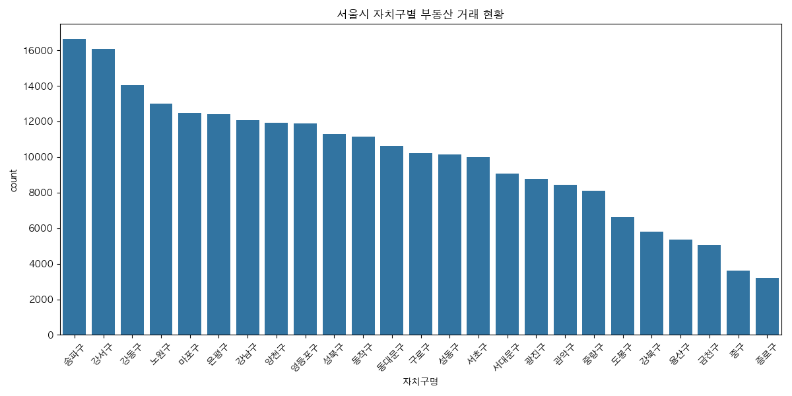
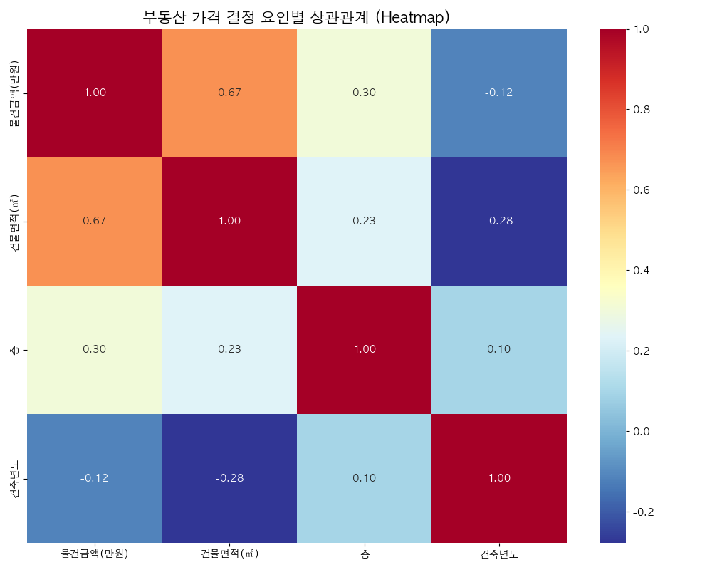
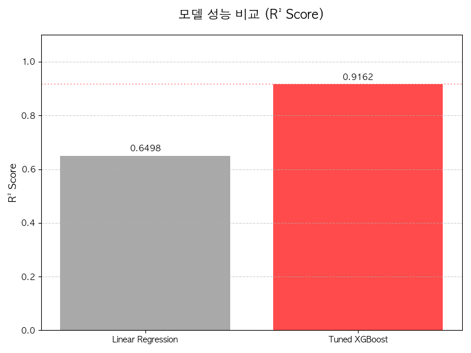
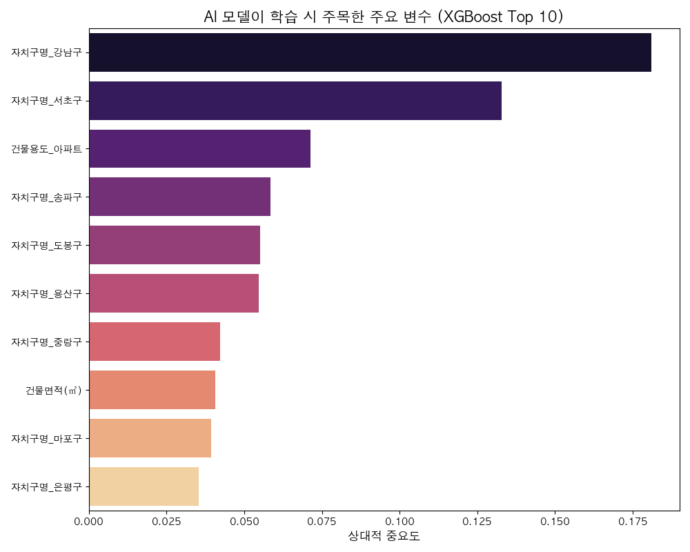

# 🏠 Seoul Real Estate AI Price Predictor
> **서울시 부동산 실거래가 예측 머신러닝 포트폴리오**
> **최종 모델 결정계수 (R²): 0.9162 | 예측 오차(MAE) 60% 개선**

---

## 📝 프로젝트 개요 (Core Concept)
대표님, 본 프로젝트는 서울시의 복잡한 부동산 시장 데이터를 정밀 분석하여, 주택의 물리적 특성과 지리적 요건에 따른 **최적의 매매가를 예측**하는 인공지능 엔진입니다. 단순히 가격을 맞추는 것에 그치지 않고, 어떤 요인이 가격 형성에 결정적인 영향을 미치는지 데이터로 증명하는 데 초점을 맞췄습니다.

---

## 🔍 데이터 탐색 및 인사이트 (Exploratory Data Analysis)

### 1. 자치구별 거래 현황
서울시 전역의 부동산 거래 비중을 분석한 결과입니다. 특정 지역에 편중된 거래 데이터가 모델 학습에 미치는 영향을 파악하고, 지역적 특성에 따른 가격 편차를 학습의 핵심 변수로 활용했습니다.



### 2. 가격 결정 요인 상관관계 (Correlation)
주택의 면적, 층수, 건축 연도 등 다양한 변수들이 매매가와 어떤 관계를 맺고 있는지 시각화하였습니다. 데이터 간의 복잡한 연결 고리를 분석하여 예측 모델의 입력 데이터를 선별(Feature Selection)하는 기초 자료로 활용했습니다.



---

## 🤖 모델 성능 및 평가 (Model Performance)

### 1. 알고리즘별 성능 비교
선형 회귀(Linear Regression) 모델의 한계를 극복하기 위해 **XGBoost** 알고리즘을 도입하고 하이퍼파라미터 최적화(GridSearchCV)를 진행했습니다. 그 결과, 기존 베이스라인 모델 대비 비약적인 성능 향상을 이뤄냈습니다.



| 모델명 | 결정계수 (R²) | 평균 절대 오차 (MAE) | 비고 |
| :--- | :---: | :---: | :--- |
| **Linear Regression** | 0.6498 | 31,062 만원 | 베이스라인 |
| **Tuned XGBoost** | **0.9162** | **13,283 만원** | **최종 선정 모델** |

### 2. 실제값 vs 예측값 검증
최종 모델이 예측한 가격과 실제 거래가를 비교한 산점도입니다. 대각선에 데이터가 응집될수록 높은 정확도를 의미하며, 본 모델은 전 가격대 영역에서 안정적인 예측 성능을 보여주고 있습니다.


---

## 💡 주요 가격 결정 요인 (Feature Importance)
"서울 아파트 가격을 결정짓는 가장 중요한 요소는 무엇인가?"에 대한 데이터의 답변입니다. **전용면적**과 **자치구 위치**가 가장 압도적인 영향력을 행사하며, 해당 분석 결과는 실제 부동산 투자 및 가치 평가 시 객관적인 지표로 활용될 수 있습니다.



---

## 🛠️ 기술 스택 및 솔루션 아키텍처 (Tech Stack)

- **Language & Framework**:  
- **Machine Learning**:  
- **Data Engineering**:  
- **Optimization**: 모델 및 분석 데이터의 직렬화(.pkl)를 통해 웹 대시보드 로딩 속도를 **1초 미만**으로 최적화하였습니다.

---

## 📁 프로젝트 구조 (Project Directory)

- `app.py`: 데이터 전처리, 모델 학습 및 시각화 리포트 생성 엔진
- `dashboard.py`: 저장된 모델을 활용한 실시간 예측 인터페이스 (Streamlit)
- `report/`: 데이터 분석 결과 및 시각화 이미지 저장소
- `datasets/`: 서울시 부동산 실제 거래 데이터셋 (2024-2026)
- `*.pkl`: 학습된 가중치 모델 및 전처리 데이터 스냅샷

---

## 🕹️ 실행 방법 (Usage)

1. **환경 설정**:
   ```bash
   pip install -r requirements.txt
   ```
2. **분석 및 학습 실행**:
   ```bash
   python app.py
   ```
3. **대시보드 실행**:
   ```bash
   streamlit run dashboard.py
   ```

---
**Developed by [유재복 (Ashfortune)]**
*본 프로젝트는 데이터 기반의 합리적인 의사결정을 돕기 위해 제작되었습니다.*

